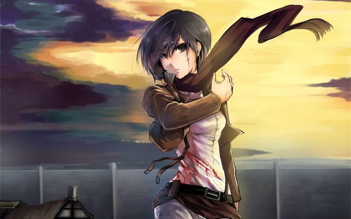

# Mikasa



> 三笠·阿克曼（Mikasa Ackerman），《进击的巨人》中女主角，艾伦·耶格尔的青梅竹马，在儿时被艾伦救过一条命。无家可归时被艾
> 伦父子带回了家，后二人经常一起活动，互相视对方为最重要的人。由于身为耶格尔家养女之故，与艾伦经常一起行动。流着东洋人血
> 统，是个沉默寡言、表情稀少的少女，与阿明·阿诺德也是旧识，小时候曾居住在同一个地区，三个人关系很要好。以第104期训练兵团
> 首席的身份毕业，性格沉稳冷静，有以一敌百的战斗力。

## Usage

After cloning (copying) this repo, you should install dependencies:

```shell
$ npm install
```

And then edit configuration files:

1. config/kafka.js
2. config/server.js

Finally, you can start up the sender:

```shell
node app.js
```
